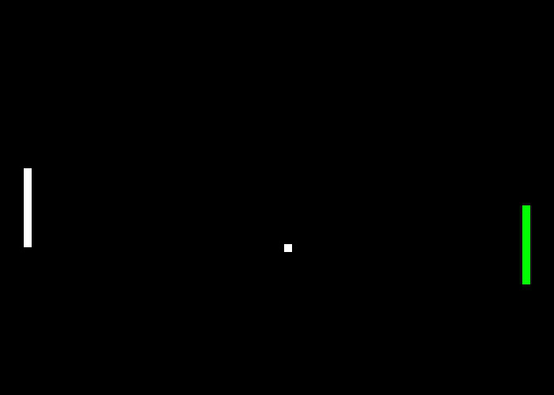

<h1>Reinforced pong using Deep Q-Net</h1>

I created this repo to play around with the Deep Q-Network algorithm.

<h3>Getting started</h3>

Make a virtual environment so that you
don't mess up the system installations and install the dependencies. These are
`opencv-python` `torch` and `pygame`. Use python3.6.

```shell script
virtualenv -p /usr/bin/python3.6 venv
source venv/bin/activate
pip install -r requirements.txt
```

<h3>Test</h3>

I trained the model on 4 mil epochs. This took ~6h on my GTX-1070.
If you wish to test my model simply type:
```shell script
python dqn.py test current_model_4000000.pth
```



<h3>Train</h3>

Should you want to train your own model, just type the command:
```shell script
python dqn.py train
```
Every 25000 epochs a checkpoint is saved in the `pretrained_model` directory.

<h3>Continue training</h3>
```shell script
python dqn.py continue <name_of_checkpoint>
```
For example:
```shell script
python dqn.py continue current_model_4000000.pth
```


